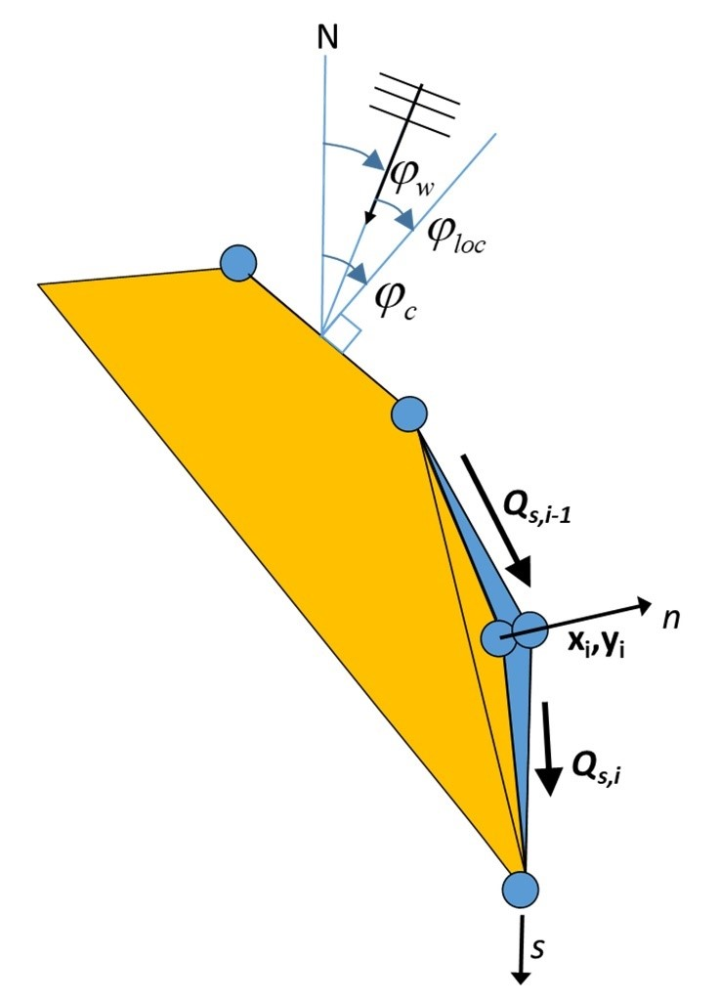
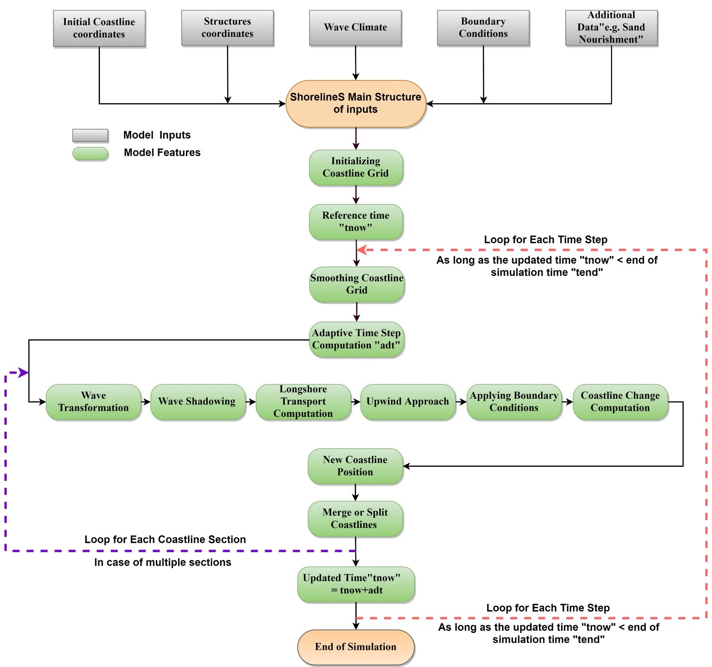

How the model works
===================

Introduction 
------------

To overcome the severe limitations of existing coastline models with a
fixed reference line, while avoiding the complexities of grid-based
approaches and geometrically complex volume reconstructions, a new
Shoreline Simulation model (ShorelineS) was developed, which is aimed at
predicting coastline evolution over periods of years to centuries. Its
description of coastlines is of strings of grid points (see :numref:`fig-image001`)
that can move around, expand and shrink freely. The coastline points are
assumed to be representative of the movement of the active coastal
profile, and hence are situated at the MSL contour. The model can have
multiple sections which may be closed (islands, lagoons). Sections can
develop spits and other features and they may break up or merge as the
simulation continues.

.. _fig-image001:

   Coastline-following coordinate system and definition of wave and coast angles. :math:`\varphi_{c}`\  is the orientation of the shore normal with respect to North; :math:`\varphi_{w}`\  is the angle of incidence of the waves with respect to North and :math:`\varphi_{loc}`\  is the local angle between waves and coast, defined as :math:`\varphi_{c} - \varphi_{w}`.

Basic equation
--------------

The basic equation for the updating of the coastline position is based
on the conservation of sediment:

.. Math::
   :label:

   \frac{\partial n}{\partial t} = - \frac{1}{D_{c}} \frac{\partial Q_{s}}{\partial s} - \frac{\text{RSLR}}{\tan\beta} + \frac{1}{D_{c}} \sum q_{i}

where *n* is the cross-shore coordinate, *s* the longshore coordinate,
*t* is time, *D\ c* is the active profile height, *Q\ s* is the
longshore transport (m\ :sup:`3`/yr), tan *β* is the average profile
slope between the dune or barrier crest and the depth of closure, *RSLR*
is the relative sea-level rise (m/yr) and *q\ i* is the source/sink term
(m\ :sup:`3`/m/yr) due to cross-shore transport, overwashing,
nourishments, sand mining and exchanges with rivers and tidal inlets. In
the Volume Balance section in the Supplementary Information we explain
why equation correctly represents the balance of both dry land area and
the sediment volume, even for curved coasts.

Transport formulations
----------------------

The coastline changes are driven by wave-driven longshore transport,
which is computed using a choice of formulations, which can be
calibrated to match the local transport rates. The formulations listed
in Table 1 have been implemented. The definitions of the angles are as
in :numref:`fig-image001`.

CERC1 and CERC2 are defined in terms of the offshore wave angle, and
CERC3 and KAMP are defined in terms of the breaking wave angle. However,
in all cases the transport follows a shape rather similar to CERC1 when
plotted against the deep water wave angle, with a maximum occurring at
an offshore angle of 40° to 45° from wave incidence.

CERC1 is the simplest formula and is mainly meant for illustrating the
principles of the behavior of the coastline model. CERC2 is derived from
the official CERC formula to formally include the effect of refraction
and shoaling. Though its behavior is quite similar to CERC1, it allows
for a direct comparison with the Coastal Evolution model that utilises
it. The CERC3 and KAMP formulas are widely used in models worldwide such
as GENESIS or UNIBEST and again can be useful for intercomparison with
such models. CERC1, CERC2 and CERC3 have a single calibration
coefficient, whereas the KAMP formula requires, usually uncertain, extra
inputs such as beach slope and grain size but has the ambition to be a
more accurate, predictive formula.

.. _tab-Implemented-longshore-transport:

.. table:: Implemented longshore transport formulations
    +---------------------------+----------+-----------------------------------------------------------------------------------------------------------------------+
    | Author                    | Notation | Formula                                                                                                               |
    +===========================+==========+=======================================================================================================================+
    | USACE (1984) (simplified) | CERC1    | .. math:: Q_{s} = bH_{S0}^{5/2} \sin{2 (\phi_{loc})}                                                                  |
    +---------------------------+----------+-----------------------------------------------------------------------------------------------------------------------+
    | Ashton and Murray (2006)  | CERC2    | .. math:: Q_{s} = K_{2H}_{S0}^{\frac\{12}{5}} T^{\frac{1}{5}} \cos^{\frac\{6}{5}}{(\phi_{loc})} \sin{(\phi_{loc})}    |
    +---------------------------+----------+-----------------------------------------------------------------------------------------------------------------------+
    | USACE (1984)              | CERC3    | ..math:: Q_{s} = bH_{sb}^{5/2} sin\{2(\phi_{locb})}                                                                   |
    +---------------------------+----------+-----------------------------------------------------------------------------------------------------------------------+
    | Kamphuis (1991)           | KAMP     | ..math:: Q_{s} = 2.33H_{sb}^{2}T^{1.5} m_{b}^{0.75} D_{50}^{- 0.25}\{sin}^{0.6}\{(} 2\phi_{locb})                     |
    +---------------------------+----------+-----------------------------------------------------------------------------------------------------------------------+

In :numref:`tab-Implemented-longshore-transport`, *H\ S0* and *H\ sb* are the significant wave height at the
offshore location and point of breaking respectively (m), *T* is the
peak wave period (s), *D\ 50* is the median grain diameter (m), *m\ b*
is the mean bed slope (beach slope in the breaking zone), *Φ\ loc* is
the relative angle of wave incidence for waves offshore and *Φ\ locb* is
the relative angle of waves at the breaking point; *b* and *K\ 2* are
the calibration coefficients of CERC1 and CERC2 formulations
respectively, which are computed as :.

.. Math::
   :label:
   `b = \frac{k \rho \sqrt{g/k}}{16(\rho_{s} - \rho)(1 - p)}`

.. Math::
   :label:
   `K_{2} = (\frac{\sqrt{g\gamma}}{2\pi})^{\frac{1}{5}} K_{1}, K_{1}\sim 0.4 m^{1/2}/s`

where *k* is the default calibration coefficient according to the Shore
Protection Manual (USACE, 1984), *ρ* the density of the water
(kg/m\ :sup:`3`), *ρ\ s* the density of the sediment (kg/m\ :sup:`3`), g
the acceleration of gravity (m/s\ :sup:`2`) and *γ* the breaker
criterion.

Numerical implementation
------------------------

The ShorelineS model is implemented in Matlab. The flow diagram of the
model is depicted in :numref:`fig-image002`. In the following we will describe the
procedure point by point.

.. _fig-image002:

   Flow diagram of the ShorelineS model.

The coastline positions are given in two column vectors *x\ mc* and
*y\ mc*, where the different coast sections are separated by NaN’s. The
sea is defined to the left when following the coastline positions. If a
section ends at the same coordinates as where it starts, it is treated
as a cyclic section and may represent either an island or a closed
lagoon. The coordinates may be in any Cartesian (metric) system.
Structures are defined in a similar way, as two column vectors where
different structures may be defined, separated by NaN’s.

The offshore wave climate can be specified in three ways:

-  By means of wave direction and a spreading sector, where a uniform
   distribution is assumed between the mean wave direction and plus or
   minus half the spreading sector. For each time step a random wave
   direction will be chosen from this sector.

-  By a wave climate consisting of a number of wave conditions
   characterized by significant wave height, peak period and mean wave
   direction, each with equal probability of occurrence. A condition
   will be chosen randomly for each time step.

-  By a time series of these wave conditions, from which the model will
   interpolate in time.

Various lateral boundary conditions were implemented in the model to
represent a variety of coastal situations. For the non-cyclic sections
the lateral boundary conditions are specified by controlling the
sediment transport rate at the start and end of the boundary, thereby
specifying a constant coastline position, a constant coastline
orientation or a periodic boundary condition. One type of boundary
condition is applied at all open-ended sections, whether existing or
newly created. The model detects when a section end point is near the
section start point and then always applies cyclic boundary conditions.

Nourishments can be prescribed through a number of polygons within which
each nourishment takes place, start and end times, and the total volume
of each nourishment. This information is then internally converted into
a shoreline accretion rate by dividing the total volume by the time
period, the length of coastline within the polygon and the profile
height, *D\ c*. By the same mechanism sediment discharged by a river can
be distributed over a coastline section within a specified polygon.
Shoreline recession as a result of relative sea level rise can be
specified, e.g., resulting from the Bruun rule (Bruun, 1962), as given
by eq. .

All inputs are collected in a single structure *S* that is passed on to
the main function ShorelineS. Preparation of the input can be done in a
tailor-made script, but ShorelineS and its sub-functions normally do not
have to be altered for a specific application. The main function
ShorelineS contains default values for all inputs that are not
application-dependent.

The cumulative distance *s* along each coast section is computed, and
this is then distributed over equidistant longshore grid cells based on
a given initial grid size. The *x* and *y* positions of the coastline
then are interpolated along *s* to obtain the *x* and *y* positions of
the grid points.

In cases where the grid sizes expand (e.g., at the tip of an expanding
spit), new grid points are inserted where the grid size exceeds twice
the initial prescribed grid size. Where the grid distances shrink (e.g.,
at an infilling bay or a shrinking spit) grid points are removed when
the grid distance becomes less than half the original grid size.

To avoid strong variations in grid size after inserting or extracting
grid cells in expanding or shrinking sections, some smoothing of the
*s*-grid is applied. The smoothing factor has to be chosen carefully as
too much smoothing may lead to a loss of planform area and will tend to
straighten out sections that should not move at all. The smoothing
formulation applied is a simple 3-point smoothing according to:

.. Math::
   :label:
   `s_{i,smooth} = fs_{i - 1} + (1 - 2f)s_{i} + fs_{i + 1}`

where *f* is a smoothing factor, with default value of 0.1. Smoothing
can lead to losses in the sediment balance and in situations where this
is critical a value closer to zero is advised.

The local wave angle is estimated through the wave transformation from
deep water to the nearshore using Snell’s law of refraction and from the
nearshore to the breaking line using the equations of van Rijn (2014).
The refraction from deep water to the toe of the dynamic profile can be
done based on the assumption of parallel offshore depth contours, or
using a 2D refraction model to provide alongshore-varying wave
conditions.

Some parts of the coastline might be sheltered by structures or other
parts (sections) of the coast. Hard structures or rocky shores are
represented by an arbitrary number of polylines, which shield waves and
block longshore transport where they cross a coastline. Thus, sea walls,
hard rocks and headlands can represent supply-limited situations where
the transport is determined by the updrift sand supply and ‘plugs’ of
sand are bypassed. The waves at any location can be shielded by other
coast sections or hard structures, see Figure SI01. This approach is
valid when the scale of the structures is much larger than the wave
length; if this is not the case, diffraction can be activated using
different approximations (Elghandour, 2018).

Given the local wave angle with respect to the coast normal and the
refracted wave conditions (or deep water wave directions in the case of
the CERC1 and CERC2 formulas) the longshore transport can be computed at\delta
each transport point between two adjacent coastline points. At present,
a choice of formulations as listed in Table 1 is available to be used.

Coastline evolution
-------------------

At each point the local direction of the coast is determined from the
two adjacent points (as a reference line), then the longshore transport
is calculated for each segment. The difference leads the points to build
out or to shrink. The mass conservation equation is solved using a
staggered forward time–central space explicit scheme (see :numref:`fig-image001`):

.. Math::
   :label:
   `\delta n_{i}^{j} = - \frac{1}{D_{c} \frac{2(Q_{s.i}^{j} - Q_{s,i - 1}^{j})}\{L_{i}\delta t`

where *j* is the time step index, :math:`\delta t`\ is the
time step (yr), *i* is the point/node index and *L\ i* is the length of
the considered grid element computed from
:math:`L_{i} = \sqrt\{(x_{i + 1} - x_{i - 1})^{2} + (y_{i + 1} - y_{i - 1})^{2}}`\ and
*x\ i* and *y\ i* are the Cartesian coordinates of point *i*. From the
normal displacement it follows that the change in position of point *i*
then becomes:

.. Math::
   :label:
   `\delta x_{i}^{j} = - \delta n_{i}^{j}\left(y_{i + 1} - y_{i - 1}\right)/L_{i}\bigm\delta y_{i}^{j} = \delta n_{i}^{j}\left(x_{i + 1} - x_{i - 1}\right)/L_{i}\bigmx_{i}^{j + 1} = x_{i}^{j} + \delta x_{i}^{j}\bigmy_{i}^{j + 1} = y_{i}^{j} + \delta y_{i}^{j}`

The scheme can be shown to be conserving the land area. Since an
explicit scheme is applied, the time step is limited by the following
criterion (Vitousek & Barnard, 2015):

.. Math::
   :label:
   `\frac{\varepsilon\delta t}\{\delta s^{2}} < \frac{1}\{2}`

where the diffusivity :math: `\varepsilon` is related to the
maximum gradient of the sediment transport with respect to the wave
angle relative to the coast, which can be approximated by:

.. Math::
   :label:
   `\{\varepsilon\ cmax}_{max}`

where *Q\ max* is the maximum transport rate in the model.

Therefore the following is obtained:

.. Math::
   :label:
   `\delta t < \frac{D_{c}\delta s^{2}}\{4Q_{max}}`

This criterion can be restrictive for small grid sizes (e.g. less than
100m). Stability is, however, guaranteed through this adaptive timestep.

High-angle instability
----------------------

A special treatment takes care of so-called high-angle instability
(Ashton et al., 2001), which allows spits to develop. In cases where the
local angle exceeds the critical angle on one side and is less than the
critical angle at the updrift side, the transport at the downdrift point
is set to the maximum transport (or the angle is set to the critical
angle). :numref:`fig-image003` illustrates the effect of this treatment, where a
central scheme would lead to unstable behavior, the local upwind
treatment ensures a smooth development into a spit. The physics in the
model is the same as in Ashton et al. (2001, 2016), and Ashton and
Murray (2006), and therefore it inherits most of the behavior of their
Coastal Evolution Model. The novelty in ShorelineS is that it achieves
the same behavior with a vector-based rather than a grid-based approach.
This is more elegant and more efficient, especially when large areas
need to be covered.

.. _Example1:
   :align: center

   .. image:: images/image003.jpg
      :width: 400px

   .. image:: images/image004.jpg
      :width: 400px

           
   Example of high-angle instability with standard central scheme (A) and upwind scheme (B).

Barrier or spit overwash
------------------------

For simulating barriers that already exist or that are in the form of
developed spits due to high wave angle instability, it was necessary to
represent the overwash process as it maintains the width of the barrier
to a certain limit (Leatherman, 1979).

(Ashton & Murray, 2006) introduced the physical process of overwash by
assuming a minimum barrier width such that sediment eroded from the
seaward side is deposited on the landward side. By simultaneously
retreating the seaward and landward sides of a section narrower than the
specified critical width, the retreating section creates a longshore
transport gradient that tends to fill it up; thus, the retreating helps
maintain the width.

A similar concept was implemented in ShorelineS in a simple approach for
treating the barrier width. At each time step, the model checks the
local barrier width at each point/node, measured in the incident wave
direction. If the barrier is narrower than the critical width, then
overwash occurs. The overwash process moves the landward point a
distance equal to the difference between the actual width and the
critical width. Such a distance is not allowed to exceed a given
percentage (e.g. 10%) of the local spatial discretization distance of
the grid per time step to avoid discretization artefacts. Then the model
looks for the closest node on the seaward side to erode it by the same
amount (Figure SI02). A possible refinement is, as in Ashton and Murray
(2006), to assume different profile depths on the seaward and landward
sides, as is logical in some settings, e.g., for the case of an eroding
barrier island. In this case the landward extension would be larger than
the erosion on the seaward side.

Merging and splitting
---------------------

One of the advantages of the ShorelineS model is that it can simulate
multiple coastal sections at the same time, and these sections can
affect each other by shielding the waves. Small parts of the coast are
allowed to split and migrate as the spits are growing and in some cases
break up and migrate as a small island. An example of the splitting
procedure is shown in Figure SI03. Such splitting typically happens when
the seaward side of a section erodes by more than the overwashing
process allows for or when the latter is not activated. The numbering is
indicated to show how the grid cell connections change after the
splitting procedure: from one continuous coastline section to two
separately numbered sections.

If two sections intersect, they may merge into one section as the
simulation continues, as is illustrated in Figure SI04. Such merging
typically happens due to shoreward migration or extension of a spit
towards the mainland coast. Again, the numbering is included to indicate
how the separate spit and mainland coast sections are now joined at the
seaward side as a continuous coastline numbered 12-20 and a lagoon
numbered 1-10.

Treatment of groynes
--------------------

Groynes can be treated simply as any structure crossing the coastline,
where the transport at the transport point closest to the intersection
between the structure polyline and the coastline is set to zero.
However, such a treatment does not give a very accurate representation
of the groyne position and local coastline evolution, and does not
account for bypassing in a smooth way. Therefore, a more eleborate
treatment was presented in Ghonim (2019), which is summarized as
follows. First, additional grid points exactly on either side of each
groyne are introduced. Second, the local coastline position at either
side of the groyne is forced to move along the groyne. Third, bypassing
and transmission are accounted for, according to the following
mechanisms.

Bypassing can be simulated in two ways, either as starting only when the
updrift accretion has reached the tip of the groyne, or gradually
increasing if the depth at the tip of the groyne is less than the depth
of active transport. The first approach follows the considerations of ,
assuming a fully impermeable structure, such as a groyne with complete
blockage of the longshore transport. Sand bypassing takes place only
when the groyne is filled with sand. Based on that, the longshore
sediment transport is set to zero at the structure and the sand
bypassing factor (*BPF*) also is set to zero from the start of the
simulation until the moment when the sediment reaches the tip of the
groyne. Then, the bypassing factor is set to its maximum value
(*BPF=1*), which means that all sediment bypasses the groyne’s tip and
moves towards its downdrift side. In that case the lateral boundary
condition at grid point *i* (see Figure SI05), which is located at the
groyne representing the bypassed volume can be expressed as:

.. Math::
   :label:
   `QS_{i} = \text{BPFQ}S_{i - 1}`

where *QS\ i* is the longshore transport at grid point *i*. There were
many options for how the bypassed sediment should be distributed
downdrift of the groyne. The most appropriate distribution of the
bypassed sediment, in line with the expected flow pattern around the
groyne, which attaches roughly at the end of the sheltered area, is to
pass all the bypassed sediment at the last sheltered grid point *ilast*
and to leave the sheltered area untouched. To do so numerically, the
lateral boundary conditions at the downdrift side of the groyne are set
as follows:

.. Math::
   :label:
   `Q\{S_{i}}_{+ 1} = Q\{S_{i}}_{+ 2}... = Q\{S_{i}}_{last} = QS_{i}`

Eq. (11) ensures that only the last sheltered grid point obtains all the
bypassed sediment and equal signs indicate that there is no sediment
transport gradient from the grid point *i* to the last sheltered grid
point *ilast*. This approach keeps the sheltered grid points fixed in
their positions except for the last one, which gives a transport
gradient to its following grid point.

That this treatment is more realistic than the classical
Pelnard-Considère solution where an erosion peak at the downdrift end of
the groyne is assumed follows from many examples worldwide, where the
erosion peak is rarely found right next to the groyne but always some
distance downdrift, due to the wave sheltering and recirculation in this
area. An example is shown in Figure SI06, for a groyne field at
Eastbourne, UK.

The second approach (Larson et al., 1987) assumes that sand bypassing
does not take place only when the groyne is totally filled with sand,
but it may take place just after the construction of the groyne. While
sand moves along the coastline, it is influenced by the presence of the
shore-normal structures, such as groynes and the response of the
coastline to those structures varies for different locations and
different types of structures. The main parameters that influence the
response of the shoreline at the structure are the structure
permeability and the bypassing ratio, which is the ratio between the
water depth at the head of the structure *D\ s* and the water depth of
the active longshore transport *D\ LT*. The bypassing ratio varies
between 0 and 1 (Hanson & Kraus, 2011).

Sand bypassing occurs at the seaward end of the groyne as long as *D\ s*
is less than *D\ LT*. The depth of the active longshore transport is
similar to the depth of the highest 1/10 waves at the updrift side of
the structure (Hanson, 1989), and represents the time-dependent depth
for longshore sediment transport, which is often less than closure depth
*D\ c*, and can be estimated as:

.. Math::
   :label:
   `D_{LT} = \frac{A_{w}}\{\gamma}\left(H_{1/3}\right)_{b}`

where *A\ w* = 1.27, a factor that converts the 1/10 highest wave height
to significant wave height [-]; *γ* is the breaker index, the ratio
between wave height to wave depth at breaking line [-] and *(H\ 1/3)\ b*
is the significant wave height at the line of breaking [m].

Based on the assumption of equilibrium profile shape (Dean, 1991), the
water depth at the structure’s head *D\ s* can be determined as:

.. Math::
   :label:
   `D_{s} = A_{p}\{y_{str}}^{2/3}`

where *A\ p* is the sediment scale parameter [m\ :sup:`1/3`] and
*y\ str* is the distance from the structure’s head to the nearest point
of the coastline [m]. In that case, the bypassing factor (*BPF*) is
estimated based on the following equation:

.. Math::
   :label:
   `\text{BPF} = 1 - \frac{D_{s}}\{D_{LT}}`

and the bypassing volume increases until reaching its maximum value when
the groyne is filled with sediment [*BPF* =1]. The lateral boundary
conditions at the groyne are otherwise equal to those for the first
approach, as given by Eqs. (6) and (7).